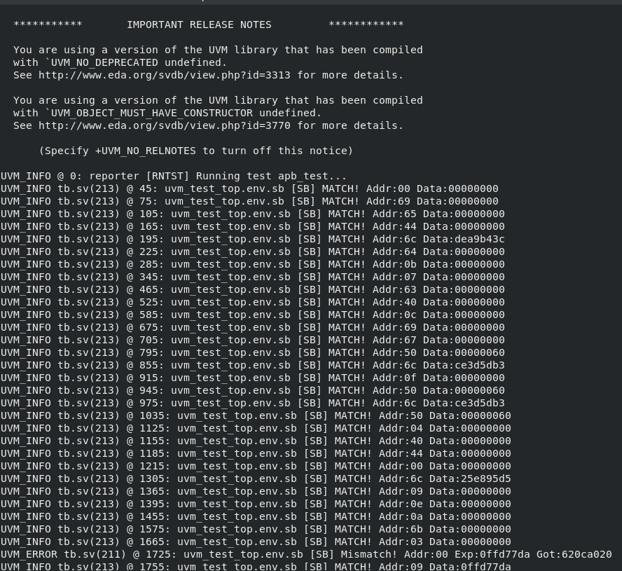
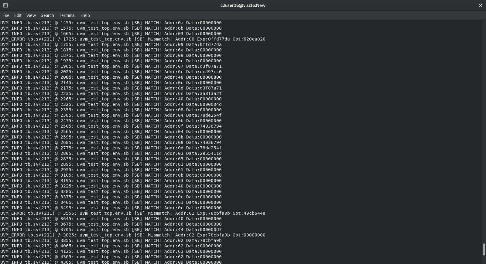
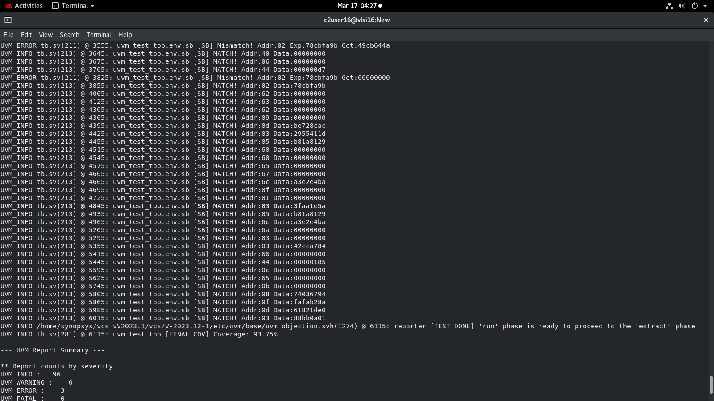
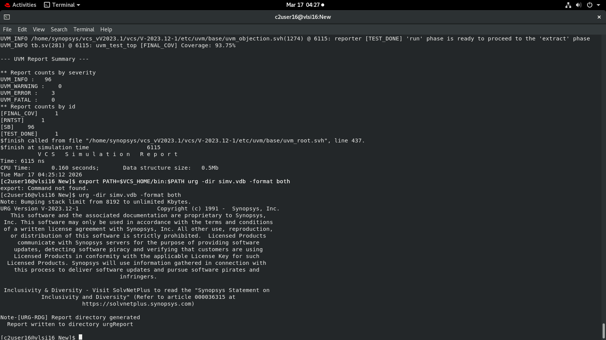

# APB-Based SoC Peripheral Subsystem with UVM Verification

## Overview

Designed and verified a mini SoC subsystem using the APB protocol. The design integrates multiple peripherals with address decoding and is verified using a UVM-based testbench.

---

## Features

* APB-based communication (PSEL, PENABLE, PREADY)
  

* Memory-mapped peripherals (ALU, GPIO, Timer, Memory)
* Address decoding for peripheral selection
* UVM testbench with driver, monitor, scoreboard
* Functional coverage and assertion-based checks

---

## Verification

* UVM environment with transaction-level modeling
* Scoreboard for data integrity checking
* Functional coverage using covergroups
* Debugging using waveform analysis

---

## Results

### Simulation Log

### Coverage Summary

* Functional Coverage: **93.75%**
* Cross Coverage: **100%**
* Variable Coverage: **91.67%**

---

## Observations

* Detected mismatches using scoreboard → debugged using waveforms
* Identified missing coverage in **ALU AND operation**
* Verified correct APB transactions across all peripherals

---

## Tools Used

* SystemVerilog, UVM 1.2
* Synopsys VCS
* URG (Coverage Analysis)

---

## Conclusion

Successfully implemented and verified an APB-based SoC subsystem with high functional coverage and effective bug detection using UVM methodology.
